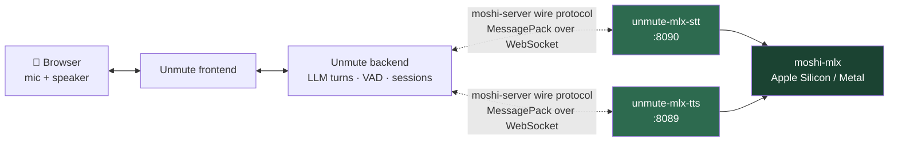

<h1 align="center">unmute-mlx-bridge</h1>

<p align="center">
  <strong>Kyutai Unmute's speech-to-speech stack — running on a Mac.</strong><br>
  No CUDA. No Linux GPU box. No changes to Unmute itself.
</p>

<p align="center">
  <a href="https://github.com/nwalker85/unmute-mlx-bridge/actions/workflows/ci.yml"></a>
  <a href="LICENSE"></a>
  
  
</p>

<p align="center">
  <a href="PROTOCOL.md">Protocol</a> ·
  <a href="#performance-envelope">Performance</a> ·
  <a href="#whats-proven--whats-not">What's proven</a> ·
  <a href="#configuration">Configuration</a> ·
  <a href="#faq--troubleshooting">FAQ</a> ·
  <a href="https://github.com/nwalker85/unmute-mlx-bridge/discussions">Discussions</a>
</p>

---

Unmute's reference model servers (`moshi-server`) are Linux/CUDA only. This
replaces them with two WebSocket servers that speak `moshi-server`'s exact wire
protocol and run inference through
[`moshi-mlx`](https://github.com/kyutai-labs/moshi) on Apple Silicon.

**Stock Unmute connects and cannot tell the difference** — no source changes,
and no configuration either: the bridge's default ports are already the ones
Unmute looks for.

> **Project status:** public pre-1.0 source release for Apple Silicon. Install
> from this repository; no PyPI package or container image is published yet.
> Use [Discussions](https://github.com/nwalker85/unmute-mlx-bridge/discussions)
> for questions and ideas, [Issues](https://github.com/nwalker85/unmute-mlx-bridge/issues)
> for reproducible defects, and [private vulnerability reporting](SECURITY.md)
> for security concerns.

> **Verified on a Mac Mini M4 Pro.** Real Kyutai weights, real MLX inference,
> and multi-turn conversations driven by the pinned stock Unmute backend. The
> default 8-bit profile runs comfortably above real time on this hardware;
> `buffered_turn` is recommended specifically for the unquantized fidelity
> profile, which remains below real time — see [Performance envelope](#performance-envelope)
> for the measured numbers before you plan against either.

<!--
  DEMO VIDEO — not yet recorded. See docs/demo-recording.md for what to capture
  and how to embed it: drag the .mp4 into a GitHub comment box, copy the
  resulting github.com/user-attachments/assets/<uuid> URL, and paste it on its
  own line right here.
-->

## Quick start

Requires [`uv`](https://docs.astral.sh/uv/) and Python 3.12 on Apple Silicon.

```bash
git clone https://github.com/nwalker85/unmute-mlx-bridge
cd unmute-mlx-bridge
uv sync --locked

# Terminal 1 — STT on ws://127.0.0.1:8090/api/asr-streaming
uv run unmute-mlx-stt

# Terminal 2 — TTS on ws://127.0.0.1:8089/api/tts_streaming
uv run unmute-mlx-tts
```

Then start stock Unmute. **No configuration required** — Unmute's
`KYUTAI_STT_URL` / `KYUTAI_TTS_URL` already default to `ws://localhost:8090`
and `ws://localhost:8089`, which is exactly where these servers listen. Point
them elsewhere only if you've changed the bridge's ports.

Both processes download weights from Hugging Face on first start (a few GB,
standard `huggingface_hub` cache — no weights are vendored here). `GET /readyz`
returns `503` until the model is loaded, so you can poll it instead of guessing.

Verify the install without touching a microphone:

```bash
# Portable: protocol + full session-lifecycle conformance against a fake
# engine. No model weights, runs on any platform.
uv run --locked pytest -q

# Hardware: real MLX inference, real weights, Apple Silicon only.
uv run --locked pytest -m hardware -q -s
```

## How it works



Everything in green is this repo. Everything else is stock, unmodified.

The compatibility claim is not "it seemed to work" — the wire format was
derived by reading real `moshi-server`'s Rust source line by line and is
documented, with citations, in [`PROTOCOL.md`](PROTOCOL.md). That document is
the oracle the implementation is tested against.

## Performance envelope

**q8 streaming is comfortably real-time on this hardware.** The previous
version of this table implied TTS generation was categorically below real
time; that was wrong for the 8-bit profile this bridge actually defaults to
— see the correction note below the table.

Measured 2026-08-31 at commit `3249e9e` on an Apple M4 Pro (Mac Mini),
synthesizing a sustained ~40s continuous-speech paragraph in-process (calling
the engine directly — no WebSocket framing overhead) with
`kyutai/tts-1.6b-en_fr`, `n_q=32` (fuller codebook depth than this project's
own `TTS_N_Q=24` default — see the note below the table), this bridge's
default voice:

| Configuration | RTF | Time-to-first-audio |
|---|---|---|
| **q8, `cfg_coef=2.0`** (this bridge's default) | **1.844×** real time | 1.54 s |
| q8, `cfg_alpha=1.5` (production Unmute's value) | **1.886×** real time | 1.05 s |
| Unquantized, `cfg_coef=2.0` | **0.589×** real time | 1.58 s |
| 4-bit | — | **Rejected — corrupts this model** (gibberish, mixed voices) |
| Reduced codebook depth | faster | **Rejected — breaks the autoregressive contract** (unintelligible) |

`n_q=32` is *more* generated codebooks than this project's own default
(`TTS_N_Q=24`, matching stock Unmute) — these figures measure a heavier
config than what a default deployment actually runs, not a lighter one.
Fewer codebooks generally means less compute per step, so a default-config
(`n_q=24`) run is expected to do at least this well, but that has not been
separately measured — run `scripts/bench_rtf.py` (below) to get your own
number at your own `n_q` rather than assume it.

**Correction (2026-08-31): the previously published "8-bit 0.594×" figure is
superseded, not confirmed.** It was measured at `cfg_coef=1.0` — a value this
engine no longer runs at all (`TTS_CFG_COEF` now always defaults to `2.0`,
see [Configuration](#configuration)) — and does not reproduce: today's q8
figure at the equivalent settings is **1.844×**, over 3× higher. Today's
*unquantized* figure at `cfg_coef=2.0` (**0.589×**) lands almost exactly on
that old "0.594×" number instead, which is the more likely explanation —
the original measurement probably exercised the unquantized path while
believed to be measuring 8-bit. Rather than silently overwrite the old
number, this note is on the record: the old table is superseded by the one
above, not merely refined.

**q8 (this bridge's default) generates faster than real time — 1.844× at the
default `cfg_coef=2.0`, 1.886× at production Unmute's `cfg_alpha=1.5`.** Both
are comfortably above `1.0×`, meaning `streaming` mode (the default delivery
mode) does not need to underrun in normal use on this hardware. The
**unquantized** profile is the one still below real time (0.589×) — best
fidelity, at a real throughput cost — and that is where `buffered_turn`
actually earns its keep:

- **`streaming`** (default) — emits audio per chunk, as upstream does. On the
  default q8 profile, measured generation outruns playback; on the
  unquantized profile, or on slower Apple Silicon, playback can underrun
  mid-sentence.
- **`buffered_turn`** — buffers the whole assistant turn, synthesizes it, then
  releases continuous audio. Recommended specifically for the unquantized
  fidelity profile (or any hardware/config combination measuring below real
  time), not as a blanket workaround for q8 streaming, which doesn't need it
  on this hardware.

Pick per deployment; both delivery modes are supported and tested regardless
of quantization profile.

STT keeps up materially better than TTS — the hardware test prints its own
`real_time_factor` so you can measure your machine rather than trust this
table. Numbers here are from one reference host and are not a promise about
yours.

**Run it on your own machine:** `uv run --locked python scripts/bench_rtf.py`
loads the real model (Apple Silicon + downloaded weights required — see the
script's own header), synthesizes a fixed ~60s paragraph, and prints your
host, commit, quantization, `n_q`, `cfg_coef`, and real-time factor in the
same shape as this table, plus time-to-first-audio.

## What's proven / what's not

Canary-stage status, stated plainly. If you're evaluating this for something
that matters, read this before the quick start.

**Proven, with evidence:**

- **Protocol fidelity.** `src/unmute_mlx_bridge/protocol/` matches real
  `moshi-server`'s message shapes field-for-field, verified against its Rust
  source — see [`PROTOCOL.md`](PROTOCOL.md).
- **Full session lifecycle.** `Ready` on connect, single-session admission
  (second connection rejected with `Error`+close), malformed-frame handling
  (`Error`, connection stays open), pre-upgrade `401` for bad auth, and
  disconnect releasing the session slot — exercised by
  `tests/test_{stt,tts}_server_conformance.py` running the real server classes
  over a real WebSocket against a deterministic fake engine. Portable; no
  weights required.
- **Real MLX inference, both directions.** Real `kyutai/stt-1b-en_fr-candle`
  weights transcribing a known `say`-synthesized fixture; real
  `kyutai/tts-1.6b-en_fr` weights synthesizing non-silent audio with
  model-derived word timings. Both re-run two sequential sessions in one
  process to prove state doesn't leak between connections.
- **Stock Unmute compatibility.** The pinned upstream backend connects to both
  servers with no source changes. A four-response load-test conversation
  completed with three user STT/semantic-VAD turns, streamed TTS on every
  response, no errors, `OK fraction: 1.0`.
- **Deterministic, artifact-free output.** Repeat runs of the deployed q8
  profile produced byte-identical PCM (matching SHA-256), zero clipping, and
  human-verified intelligibility, cadence, and stable voice identity.
- **Full-process, real-weight protocol + loopback evidence (2026-08-31,
  21/21).** Real TTS and STT server processes, real Kyutai weights, real
  WebSocket connections end to end: a `Voice` message at session start
  produces byte-identical audio to the equivalent `?voice=` query parameter;
  the full pre-`Ready` rejection matrix (bad `format=`, unsupported
  `cfg_alpha=`, unparsable/out-of-range numeric params, unresolvable
  `voice=`/`voices=`, a second concurrent connection) is exercised against
  the real server, not a fake engine; and TTS's own synthesized audio,
  looped back into STT, produces a correct transcript with `Step.prs`
  present and the requested `Marker` echoed back.

**Not yet proven — the honest gaps:**

- **No documented end-to-end microphone → speaker canary against *stock*
  Unmute.** The compatibility evidence above (both the backend load test and
  the 2026-08-31 protocol/loopback run) is backend- and script-driven. The
  full browser-mic path has been exercised during development, but not as
  a recorded gate on an unmodified upstream checkout — so it isn't claimed
  here.
- No sustained or long-duration real-time-factor measurement; no
  concurrent-load testing; no memory-growth-over-many-sessions measurement.
- No barge-in / cancellation-under-load testing beyond a clean WebSocket close.
- Voice quality (MOS) is unmeasured. The q8 tonal loss described above is one
  listener's assessment, not a scored evaluation.
- The published measurements come from a single reference host.

## Configuration

Both servers are configured entirely through environment variables — no config
file, no CLI flags. See `src/unmute_mlx_bridge/config.py` for the full list,
defaults, and validation.

| Var | Server | Meaning |
|---|---|---|
| `STT_HOST`, `STT_PORT` | STT | Bind address, default `127.0.0.1:8090` |
| `STT_HF_REPO` | STT | Default `kyutai/stt-1b-en_fr-candle` |
| `STT_QUANTIZE_BITS` | STT | Post-load quantization, e.g. `4` or `8` |
| `STT_MAX_STEPS` | STT | Per-session step budget before a reconnect is required |
| `STT_AUTHORIZED_IDS` | STT | Comma-separated accepted tokens; empty disables auth |
| `STT_LOG_TRANSCRIPTS` | STT | Log full transcript text (default `false`) |
| `TTS_HOST`, `TTS_PORT` | TTS | Bind address, default `127.0.0.1:8089` |
| `TTS_HF_REPO` | TTS | Default `kyutai/tts-1.6b-en_fr` |
| `TTS_DEFAULT_VOICE` | TTS | Voice used when the client doesn't pass `?voice=`. Default `unmute-prod-website/p329_022.wav` (CC BY 4.0, attribution required) — see [Voice licensing](#voice-licensing) before changing it to an `expresso/`/`ears/` voice |
| `TTS_N_Q` | TTS | Generated codebook depth, default `24` (matches stock Unmute). **Do not lower to buy speed** — see [Performance envelope](#performance-envelope) |
| `TTS_CFG_COEF` | TTS | Session-default classifier-free-guidance conditioning strength, default `2.0`. Must be a positive, finite number (checked at config-parse time, before any Hugging Face download, naming `TTS_CFG_COEF` in the error). Whether it's one of the *specific* values this model supports (`{1.0, 1.5, 2.0, 2.5, 3.0, 3.5, 4.0}` for `kyutai/tts-1.6b-en_fr`) is checked at model load, once the model's own supported set is known — see "If model load fails" below for what happens then; **this does not fail startup outright**, contrary to an earlier version of this line. A client's per-request `?cfg_alpha=` query param is checked against the same set before a channel slot is even taken (`?cfg_alpha=` with an unsupported value gets an `Error`, no `Ready`) and always overrides this default for that session. |
| `TTS_QUANTIZE_BITS` | TTS | `8` is the validated profile; **`4` corrupts this model** |
| `TTS_DELIVERY_MODE` | TTS | `streaming` (default) or `buffered_turn` |
| `TTS_MAX_BUFFERED_CHARS` | TTS | Buffered-mode input bound, default `4096` |
| `TTS_MAX_BUFFERED_AUDIO_SECONDS` | TTS | Buffered-mode audio bound, default `60` |
| `TTS_AUTHORIZED_IDS` | TTS | Comma-separated accepted tokens; empty disables auth |
| `TTS_LOG_TRANSCRIPTS` | TTS | Log full synthesized text (default `false`) |
| `NTP_SOURCE` | both | Host checked (DNS only) at startup for the clock-metadata log line; default `pool.ntp.org` |

Both servers accept `kyutai-api-key: public_token` (or `?auth_id=public_token`)
by default, matching upstream's loopback-dev posture. Override with
`STT_AUTHORIZED_IDS` / `TTS_AUTHORIZED_IDS` before binding to anything that
isn't loopback.

> **Transcript logging is off by default.** `STT_LOG_TRANSCRIPTS` /
> `TTS_LOG_TRANSCRIPTS` write full spoken and synthesized text into structured
> logs. Enable them only where you control the log sink and have consent from
> whoever is speaking.

> **Why `TTS_CFG_COEF` defaults to `2.0`, not `1.0`.** Upstream `moshi-server`'s
> own `tts.toml` ships `cfg_coef = 2.0`, and production Unmute sends
> `cfg_alpha=1.5` on every request (`unmute/tts/voices.py`) — neither upstream
> component ever runs this model at `1.0`. This bridge's engine used to
> hardcode `1.0` at model load, which renders synthesized voices nearly flat
> compared to either upstream value; `TTS_CFG_COEF=2.0` restores parity with
> the stock TOML default while still letting a per-request `cfg_alpha=`
> override it.

## Talking to a running server manually

```bash
# STT: send one msgpack Audio frame, print whatever comes back
uv run python - <<'EOF'
import asyncio, msgpack, websockets

async def main():
    async with websockets.connect(
        "ws://127.0.0.1:8090/api/asr-streaming",
        additional_headers={"kyutai-api-key": "public_token"},
    ) as ws:
        print(msgpack.unpackb(await ws.recv(decode=False)))  # {'type': 'Ready'}
        await ws.send(msgpack.packb({"type": "Audio", "pcm": [0.0] * 1920}))
        print(msgpack.unpackb(await ws.recv(decode=False)))

asyncio.run(main())
EOF
```

Both servers also expose `GET /healthz` (liveness), `GET /readyz` (model loaded
and a session slot free), and `GET /metrics` (Prometheus) on the same port as
the WebSocket endpoint.

> **If model load fails** (an unsupported `TTS_CFG_COEF`, a network failure
> fetching weights from Hugging Face, corrupt weights, etc.), the process does
> not exit. It keeps serving `/healthz`, `/readyz`, and `/metrics` so an
> external supervisor or operator can observe the failure through `/readyz`'s
> `model_load_error` field (see `src/unmute_mlx_bridge/observability.py::
> ServiceHealth`) rather than the process disappearing outright — this
> project is not deployed behind an orchestrator that would otherwise restart
> it (see `AGENTS.md`'s Deploy Model section: local Apple Silicon, canary
> only). A client that connects during this state gets `{"type": "Error",
> "message": "model failed to load"}` and a clean close — distinct from the
> `"model still loading"` message sent before the load attempt has finished
> either way.

## Hardware evidence

Opt-in tests that download real weights and run real inference:

- `tests/hardware/test_stt_hardware.py` — synthesizes a known sentence with
  macOS `say`, transcribes it with real weights through `moshi-mlx`, asserts the
  expected words appear with monotonically increasing timestamps, proves the
  semantic-VAD head crosses stock Unmute's pause threshold on trailing silence,
  and runs two sequential sessions to confirm state doesn't leak.
- `tests/hardware/test_tts_hardware.py` — synthesizes a known sentence with real
  weights, asserts non-silent audio (RMS threshold), plausible duration, and
  monotonically ordered word timings. Writes the WAV to a temp path so you can
  listen to it yourself, and repeats the state-leak check.

```bash
uv run --locked pytest -m hardware -q -s
```

Both print `real_time_factor` (audio seconds ÷ wall-clock seconds). Run them
before trusting anything downstream — that number is the first hard question
this project asks.

**Hardware CI.** `.github/workflows/ci.yml` can run this exact suite
(`pytest -m hardware -q -s`) on a `macos-14` Apple Silicon runner. It is a
manual `workflow_dispatch` option, not a pull-request job: real-model proof
downloads several gigabytes of Kyutai weights and must never be triggered by
untrusted contributions. The Hugging Face cache is preserved between approved
runs and invalidated when the configured model repositories change.

## FAQ / troubleshooting

**Do I need a GPU?** No. MLX uses the Mac's unified memory and Metal.

**Is it fast enough for live conversation?** Yes — on the reference Mac Mini
M4 Pro, the default 8-bit profile generates faster than real time (see
[Performance envelope](#performance-envelope)), so `streaming` mode (the
default) does not need `buffered_turn` to keep up in normal use. Only the
unquantized fidelity profile runs below real time; use `buffered_turn` there,
or on slower Apple Silicon generally, to trade a longer pre-speech wait for
uninterrupted playback instead of mid-sentence underruns. Measure your own
hardware before committing to a latency budget.

**First start hangs.** It's downloading several GB of weights. Poll
`GET /readyz` — `503` until loaded.

**`401` on connect.** Your client isn't sending a token this server accepts.
Default accepts `public_token` via the `kyutai-api-key` header or `auth_id`
query param — see [`PROTOCOL.md`](PROTOCOL.md).

**Second connection rejected.** Each server admits one session at a time,
matching stock `moshi-server`. Disconnect the first, or run another instance on
a different port.

**Speech sounds halting or stutters.** You're likely generating below real
time in `streaming` mode — expected on the unquantized profile, or on slower
Apple Silicon than the reference host even at q8 (see
[Performance envelope](#performance-envelope)). Try
`TTS_DELIVERY_MODE=buffered_turn`.

**Can I speed it up with `TTS_QUANTIZE_BITS=4` or a lower `TTS_N_Q`?** No —
both are tested, documented failure modes on this model. See
[Performance envelope](#performance-envelope).

**Can I run this on Linux/CUDA?** That's what upstream `moshi-server` is for.
This project exists specifically for Apple Silicon.

**Is this affiliated with Kyutai?** No. See [Attribution](#attribution).

## Repository map

| Path | What |
|---|---|
| [`PROTOCOL.md`](PROTOCOL.md) | Wire-format compatibility writeup — **start here** before touching the protocol layer |
| `src/unmute_mlx_bridge/protocol/` | msgpack message models (`stt.py`, `tts.py`) and framing (`wire.py`) |
| `src/unmute_mlx_bridge/{stt,tts}/` | `engine.py` (MLX inference + state machine), `server.py` (WebSocket, health, auth, admission) |
| `src/unmute_mlx_bridge/observability.py` | Shared `/healthz`, `/readyz`, `/metrics`, auth |
| `src/unmute_mlx_bridge/config.py` | Environment-driven configuration |
| `tests/` | Portable protocol + conformance suite |
| `tests/hardware/` | Opt-in real-MLX suite (`pytest -m hardware`) |
| `docs/observability.md` | Metrics, structured logging, clock metadata |
| [`docs/design/architecture.md`](docs/design/architecture.md) | Full design spec and non-goals |
| [`docs/architecture/decisions/`](docs/architecture/decisions/) | Architecture decision records and compatibility constraints |
| [`docs/runbooks/deploy.md`](docs/runbooks/deploy.md) | Deployment runbook: service shape, env, ports, health |
| [`examples/`](examples/README.md) | Minimal TTS/STT WebSocket clients — a quick manual check or a starting point for your own client |
| [`scripts/bench_rtf.py`](scripts/bench_rtf.py) | Real-time-factor benchmark on your own hardware — see [Performance envelope](#performance-envelope) |
| [`CHANGELOG.md`](CHANGELOG.md) | Release history |
| [`CONTRIBUTING.md`](CONTRIBUTING.md) | Development workflow, protocol-change rules, and evidence expectations |

## Contributing

Issues and pull requests are welcome. See
[`CONTRIBUTING.md`](CONTRIBUTING.md) for workflow and commit conventions, and
[`CODE_OF_CONDUCT.md`](CODE_OF_CONDUCT.md).

Found a security issue? See [`SECURITY.md`](SECURITY.md) — please don't open a
public issue for it.

If you're reporting a performance result, include your Mac model, the exact
config, and the `real_time_factor` the hardware tests printed. Numbers without
that context aren't comparable.

## Attribution

An **unofficial community project**. Not an official Kyutai release, and not
affiliated with or endorsed by Kyutai.

Built against, and compatible with:

- [Kyutai Unmute](https://github.com/kyutai-labs/unmute)
- [Kyutai Moshi](https://github.com/kyutai-labs/moshi) (`moshi-server`, `moshi-mlx`)
- [Kyutai Delayed Streams Modeling](https://github.com/kyutai-labs/delayed-streams-modeling)

Model weights (`kyutai/stt-1b-en_fr-candle`, `kyutai/tts-1.6b-en_fr`) are **not
redistributed** here. They retain their CC-BY-4.0 license from Kyutai. See
[`NOTICE`](NOTICE) for full attribution text.

### Voice licensing

Voices (`voice=`/`voices=` query params, and this bridge's own
`TTS_DEFAULT_VOICE`) are **not redistributed** here either — they are fetched
at runtime from Kyutai's `kyutai/tts-voices` repository on Hugging Face, and
this project does not vendor, cache, or ship any of them. **Licensing is
per-directory, and it is not uniformly permissive** — read this before picking
a voice for anything beyond local experimentation:

| Voice path prefix | License | Commercial use |
|---|---|---|
| `unmute-prod-website/*` | CC0, **except**: `degaulle-2.wav` (public domain, 1940 recording), `ex04_narration_longform_00001.wav` (CC BY-NC 4.0, sourced from Expresso), **`p329_022.wav` (CC BY 4.0, sourced from VCTK — this bridge's default)** | Yes, for the CC0 files; yes with attribution for `p329_022.wav` |
| `voice-donations/*` | CC0 | Yes |
| `vctk/*` | CC BY 4.0 | Yes, with attribution |
| `cml-tts/*` | CC BY 4.0 | Yes, with attribution |
| `expresso/*` | **CC BY-NC 4.0** | **No** |
| `ears/*` | **CC BY-NC 4.0** | **No** |

Source: `kyutai/tts-voices`'s own README ("The others are our own recordings
and you may use them as CC0" for `unmute-prod-website/`; each other directory
states its license inline). Verify against that README directly before
shipping a product built on a specific voice — it is the authority here, not
this table.

**This bridge's built-in default (`TTS_DEFAULT_VOICE`) is
`unmute-prod-website/p329_022.wav`** — Nate's blind-audition pick. Despite
living under `unmute-prod-website/`, this specific file is VCTK speaker p329,
so it is licensed **CC BY 4.0, not CC0**: commercially safe, attribution
required. **Attribution: uses a voice from the VCTK corpus (CSTR, University
of Edinburgh), CC BY 4.0** (see [`NOTICE`](NOTICE) for the full attribution
text). This is a
deliberate deviation from upstream `moshi-server`'s own default
(`unmute-prod-website/default_voice.wav`, CC0) — a preference choice, not a
correctness fix. If you'd rather default to a CC0 voice with no attribution
obligation, set `TTS_DEFAULT_VOICE=unmute-prod-website/default_voice.wav` (the
upstream default) or any `voice-donations/*` voice. The CC BY-NC 4.0
`expresso/`/`ears/` voices remain **opt-in only**: set `TTS_DEFAULT_VOICE` or
pass `?voice=`/`?voices=` explicitly to use one, and do not use them in
anything commercial. **No voice served through this bridge is blanket CC BY
4.0** — that would be wrong for the NC-licensed directories above; the
per-directory table is the accurate picture.

## License

Apache-2.0 — see [LICENSE](LICENSE).
