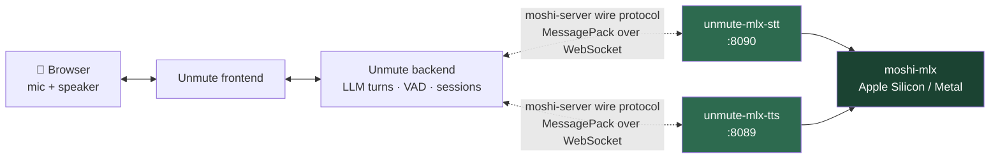

<h1 align="center">unmute-mlx-bridge</h1>

<p align="center">
  <strong>Kyutai Unmute's speech-to-speech stack — running on a Mac.</strong><br>
  No CUDA. No Linux GPU box. No changes to Unmute itself.
</p>

<p align="center">
  <a href="LICENSE"></a>
  
  
</p>

<p align="center">
  <a href="PROTOCOL.md">Protocol</a> ·
  <a href="#performance-envelope">Performance</a> ·
  <a href="#whats-proven--whats-not">What's proven</a> ·
  <a href="#configuration">Configuration</a> ·
  <a href="#faq--troubleshooting">FAQ</a>
</p>

---

Unmute's reference model servers (`moshi-server`) are Linux/CUDA only. This
replaces them with two WebSocket servers that speak `moshi-server`'s exact wire
protocol and run inference through
[`moshi-mlx`](https://github.com/kyutai-labs/moshi) on Apple Silicon.

**Stock Unmute connects and cannot tell the difference** — no source changes,
and no configuration either: the bridge's default ports are already the ones
Unmute looks for.

> **Verified on a Mac Mini M4 Pro.** Real Kyutai weights, real MLX inference,
> and a multi-turn conversation driven by the pinned stock Unmute backend.
> TTS generates *below* real time on this hardware — see
> [Performance envelope](#performance-envelope) for the number and what it
> costs you.

<!--
  DEMO VIDEO — not yet recorded. See docs/demo-recording.md for what to capture
  and how to embed it: drag the .mp4 into a GitHub comment box, copy the
  resulting github.com/user-attachments/assets/<uuid> URL, and paste it on its
  own line right here.
-->

## Quick start

Requires [`uv`](https://docs.astral.sh/uv/) and Python 3.12 on Apple Silicon.

```bash
git clone https://github.com/nwalker85/unmute-mlx-bridge
cd unmute-mlx-bridge
uv sync --locked

# Terminal 1 — STT on ws://127.0.0.1:8090/api/asr-streaming
uv run unmute-mlx-stt

# Terminal 2 — TTS on ws://127.0.0.1:8089/api/tts_streaming
uv run unmute-mlx-tts
```

Then start stock Unmute. **No configuration required** — Unmute's
`KYUTAI_STT_URL` / `KYUTAI_TTS_URL` already default to `ws://localhost:8090`
and `ws://localhost:8089`, which is exactly where these servers listen. Point
them elsewhere only if you've changed the bridge's ports.

Both processes download weights from Hugging Face on first start (a few GB,
standard `huggingface_hub` cache — no weights are vendored here). `GET /readyz`
returns `503` until the model is loaded, so you can poll it instead of guessing.

Verify the install without touching a microphone:

```bash
# Portable: protocol + full session-lifecycle conformance against a fake
# engine. No model weights, runs on any platform.
uv run --locked pytest -q          # 135 passed, 5 deselected

# Hardware: real MLX inference, real weights, Apple Silicon only.
uv run --locked pytest -m hardware -q -s
```

## How it works



Everything in green is this repo. Everything else is stock, unmodified.

The compatibility claim is not "it seemed to work" — the wire format was
derived by reading real `moshi-server`'s Rust source line by line and is
documented, with citations, in [`PROTOCOL.md`](PROTOCOL.md). That document is
the oracle the implementation is tested against.

## Performance envelope

Measured on a Mac Mini M4 Pro with `kyutai/tts-1.6b-en_fr`, at full generated
codebook depth:

| Configuration | TTS output rate | Verdict |
|---|---|---|
| Unquantized | **0.374×** real time | Best fidelity; well below real time |
| Full-model 8-bit | **0.594×** real time | Validated profile; slight loss of low/mid richness |
| 4-bit | — | **Rejected — corrupts this model** (gibberish, mixed voices) |
| Reduced codebook depth | faster | **Rejected — breaks the autoregressive contract** (unintelligible) |

**Read that honestly: TTS on this hardware generates slower than real time.**
An output rate of 0.594× means ~3.5 seconds of speech takes ~6 seconds to
synthesize. That is the single most important number in this README, and it is
why the delivery mode matters:

- **`streaming`** (default) — emits audio per chunk, as upstream does. On
  hardware that generates below real time, playback can underrun mid-sentence.
- **`buffered_turn`** — buffers the whole assistant turn, synthesizes it, then
  releases continuous audio. A deliberate latency-for-continuity trade: it does
  not make generation faster, it converts intermittent stutter into a single
  pre-speech wait followed by clean, uninterrupted speech.

On faster Apple Silicon, or with shorter turns, the streaming path is more
comfortable. Pick per deployment; both are supported and tested.

STT keeps up materially better than TTS — the hardware test prints its own
`real_time_factor` so you can measure your machine rather than trust this
table. Numbers here are from one reference host and are not a promise about
yours.

## What's proven / what's not

Canary-stage status, stated plainly. If you're evaluating this for something
that matters, read this before the quick start.

**Proven, with evidence:**

- **Protocol fidelity.** `src/unmute_mlx_bridge/protocol/` matches real
  `moshi-server`'s message shapes field-for-field, verified against its Rust
  source — see [`PROTOCOL.md`](PROTOCOL.md).
- **Full session lifecycle.** `Ready` on connect, single-session admission
  (second connection rejected with `Error`+close), malformed-frame handling
  (`Error`, connection stays open), pre-upgrade `401` for bad auth, and
  disconnect releasing the session slot — exercised by
  `tests/test_{stt,tts}_server_conformance.py` running the real server classes
  over a real WebSocket against a deterministic fake engine. Portable; no
  weights required.
- **Real MLX inference, both directions.** Real `kyutai/stt-1b-en_fr-candle`
  weights transcribing a known `say`-synthesized fixture; real
  `kyutai/tts-1.6b-en_fr` weights synthesizing non-silent audio with
  model-derived word timings. Both re-run two sequential sessions in one
  process to prove state doesn't leak between connections.
- **Stock Unmute compatibility.** The pinned upstream backend connects to both
  servers with no source changes. A four-response load-test conversation
  completed with three user STT/semantic-VAD turns, streamed TTS on every
  response, no errors, `OK fraction: 1.0`.
- **Deterministic, artifact-free output.** Repeat runs of the deployed q8
  profile produced byte-identical PCM (matching SHA-256), zero clipping, and
  human-verified intelligibility, cadence, and stable voice identity.

**Not yet proven — the honest gaps:**

- **No documented end-to-end microphone → speaker canary against *stock*
  Unmute.** The compatibility evidence above is a backend-driven load test.
  The full browser-mic path has been exercised during development, but not as
  a recorded gate on an unmodified upstream checkout — so it isn't claimed
  here.
- No sustained or long-duration real-time-factor measurement; no
  concurrent-load testing; no memory-growth-over-many-sessions measurement.
- No barge-in / cancellation-under-load testing beyond a clean WebSocket close.
- Voice quality (MOS) is unmeasured. The q8 tonal loss described above is one
  listener's assessment, not a scored evaluation.
- The published measurements come from a single reference host.

## Configuration

Both servers are configured entirely through environment variables — no config
file, no CLI flags. See `src/unmute_mlx_bridge/config.py` for the full list,
defaults, and validation.

| Var | Server | Meaning |
|---|---|---|
| `STT_HOST`, `STT_PORT` | STT | Bind address, default `127.0.0.1:8090` |
| `STT_HF_REPO` | STT | Default `kyutai/stt-1b-en_fr-candle` |
| `STT_QUANTIZE_BITS` | STT | Post-load quantization, e.g. `4` or `8` |
| `STT_MAX_STEPS` | STT | Per-session step budget before a reconnect is required |
| `STT_AUTHORIZED_IDS` | STT | Comma-separated accepted tokens; empty disables auth |
| `STT_LOG_TRANSCRIPTS` | STT | Log full transcript text (default `false`) |
| `TTS_HOST`, `TTS_PORT` | TTS | Bind address, default `127.0.0.1:8089` |
| `TTS_HF_REPO` | TTS | Default `kyutai/tts-1.6b-en_fr` |
| `TTS_DEFAULT_VOICE` | TTS | Voice used when the client doesn't pass `?voice=` |
| `TTS_N_Q` | TTS | Generated codebook depth, default `24` (matches stock Unmute). **Do not lower to buy speed** — see [Performance envelope](#performance-envelope) |
| `TTS_QUANTIZE_BITS` | TTS | `8` is the validated profile; **`4` corrupts this model** |
| `TTS_DELIVERY_MODE` | TTS | `streaming` (default) or `buffered_turn` |
| `TTS_MAX_BUFFERED_CHARS` | TTS | Buffered-mode input bound, default `4096` |
| `TTS_MAX_BUFFERED_AUDIO_SECONDS` | TTS | Buffered-mode audio bound, default `60` |
| `TTS_AUTHORIZED_IDS` | TTS | Comma-separated accepted tokens; empty disables auth |
| `TTS_LOG_TRANSCRIPTS` | TTS | Log full synthesized text (default `false`) |
| `NTP_SOURCE` | both | Host checked (DNS only) at startup for the clock-metadata log line; default `pool.ntp.org` |

Both servers accept `kyutai-api-key: public_token` (or `?auth_id=public_token`)
by default, matching upstream's loopback-dev posture. Override with
`STT_AUTHORIZED_IDS` / `TTS_AUTHORIZED_IDS` before binding to anything that
isn't loopback.

> **Transcript logging is off by default.** `STT_LOG_TRANSCRIPTS` /
> `TTS_LOG_TRANSCRIPTS` write full spoken and synthesized text into structured
> logs. Enable them only where you control the log sink and have consent from
> whoever is speaking.

## Talking to a running server manually

```bash
# STT: send one msgpack Audio frame, print whatever comes back
uv run python - <<'EOF'
import asyncio, msgpack, websockets

async def main():
    async with websockets.connect(
        "ws://127.0.0.1:8090/api/asr-streaming",
        additional_headers={"kyutai-api-key": "public_token"},
    ) as ws:
        print(msgpack.unpackb(await ws.recv(decode=False)))  # {'type': 'Ready'}
        await ws.send(msgpack.packb({"type": "Audio", "pcm": [0.0] * 1920}))
        print(msgpack.unpackb(await ws.recv(decode=False)))

asyncio.run(main())
EOF
```

Both servers also expose `GET /healthz` (liveness), `GET /readyz` (model loaded
and a session slot free), and `GET /metrics` (Prometheus) on the same port as
the WebSocket endpoint.

## Hardware evidence

Opt-in tests that download real weights and run real inference:

- `tests/hardware/test_stt_hardware.py` — synthesizes a known sentence with
  macOS `say`, transcribes it with real weights through `moshi-mlx`, asserts the
  expected words appear with monotonically increasing timestamps, proves the
  semantic-VAD head crosses stock Unmute's pause threshold on trailing silence,
  and runs two sequential sessions to confirm state doesn't leak.
- `tests/hardware/test_tts_hardware.py` — synthesizes a known sentence with real
  weights, asserts non-silent audio (RMS threshold), plausible duration, and
  monotonically ordered word timings. Writes the WAV to a temp path so you can
  listen to it yourself, and repeats the state-leak check.

```bash
uv run --locked pytest -m hardware -q -s
```

Both print `real_time_factor` (audio seconds ÷ wall-clock seconds). Run them
before trusting anything downstream — that number is the first hard question
this project asks.

## FAQ / troubleshooting

**Do I need a GPU?** No. MLX uses the Mac's unified memory and Metal.

**Is it fast enough for live conversation?** On a Mac Mini M4 Pro, TTS
generates below real time — see [Performance envelope](#performance-envelope).
It is usable with `buffered_turn`; it is not the same experience as a CUDA box.
Measure your own hardware before committing.

**First start hangs.** It's downloading several GB of weights. Poll
`GET /readyz` — `503` until loaded.

**`401` on connect.** Your client isn't sending a token this server accepts.
Default accepts `public_token` via the `kyutai-api-key` header or `auth_id`
query param — see [`PROTOCOL.md`](PROTOCOL.md).

**Second connection rejected.** Each server admits one session at a time,
matching stock `moshi-server`. Disconnect the first, or run another instance on
a different port.

**Speech sounds halting or stutters.** You're likely generating below real time
in `streaming` mode. Try `TTS_DELIVERY_MODE=buffered_turn`.

**Can I speed it up with `TTS_QUANTIZE_BITS=4` or a lower `TTS_N_Q`?** No —
both are tested, documented failure modes on this model. See
[Performance envelope](#performance-envelope).

**Can I run this on Linux/CUDA?** That's what upstream `moshi-server` is for.
This project exists specifically for Apple Silicon.

**Is this affiliated with Kyutai?** No. See [Attribution](#attribution).

## Repository map

| Path | What |
|---|---|
| [`PROTOCOL.md`](PROTOCOL.md) | Wire-format compatibility writeup — **start here** before touching the protocol layer |
| `src/unmute_mlx_bridge/protocol/` | msgpack message models (`stt.py`, `tts.py`) and framing (`wire.py`) |
| `src/unmute_mlx_bridge/{stt,tts}/` | `engine.py` (MLX inference + state machine), `server.py` (WebSocket, health, auth, admission) |
| `src/unmute_mlx_bridge/observability.py` | Shared `/healthz`, `/readyz`, `/metrics`, auth |
| `src/unmute_mlx_bridge/config.py` | Environment-driven configuration |
| `tests/` | Portable protocol + conformance suite |
| `tests/hardware/` | Opt-in real-MLX suite (`pytest -m hardware`) |
| `docs/observability.md` | Metrics, structured logging, clock metadata |
| `docs/superpowers/specs/2026-07-26-unmute-mlx-bridge-design.md` | Full design spec and non-goals |
| `CHANGELOG.md` | Release history |

## Contributing

Issues and pull requests are welcome. See
[`CONTRIBUTING.md`](CONTRIBUTING.md) for workflow and commit conventions, and
[`CODE_OF_CONDUCT.md`](CODE_OF_CONDUCT.md).

Found a security issue? See [`SECURITY.md`](SECURITY.md) — please don't open a
public issue for it.

If you're reporting a performance result, include your Mac model, the exact
config, and the `real_time_factor` the hardware tests printed. Numbers without
that context aren't comparable.

## Attribution

An **unofficial community project**. Not an official Kyutai release, and not
affiliated with or endorsed by Kyutai.

Built against, and compatible with:

- [Kyutai Unmute](https://github.com/kyutai-labs/unmute)
- [Kyutai Moshi](https://github.com/kyutai-labs/moshi) (`moshi-server`, `moshi-mlx`)
- [Kyutai Delayed Streams Modeling](https://github.com/kyutai-labs/delayed-streams-modeling)

Model weights (`kyutai/stt-1b-en_fr-candle`, `kyutai/tts-1.6b-en_fr`) are **not
redistributed** here. They retain their CC-BY-4.0 license from Kyutai. See
[`NOTICE`](NOTICE) for full attribution text.

## License

Apache-2.0 — see [LICENSE](LICENSE).
